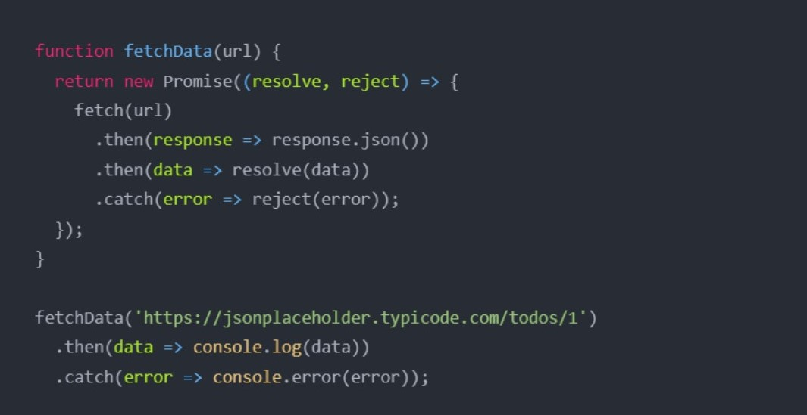

"# Lecture-7" 
# Синхронный и асинхронный код
```js
Синхронный и асинхронный в JavaScript. Синхронный JavaScript: Как следует из названия, синхронный означает быть последовательным, т.е. каждый оператор кода выполняется один за другим. Итак, по сути, оператор должен дождаться выполнения предыдущего оператора
например:
```


# асинхронный код
```
Давайте рассмотрим пример, который дополнительно иллюстрирует природу асинхронного кода, показывая, что может произойти, когда мы не полностью осознаем порядок выполнения кода, и проблемы, связанные с попыткой трактовать асинхронный код как синхронный
например:
```


# АСИНХРОННЫЙ ПРОТИВ СИНХРОННОГО


# АСИНХРОННЫЙ
```js
Асинхронный код на JavaScript может быть написан с использованием
обратных вызовов,
обещаний,
синтаксиса async/await
```
# CALLBACK
```
Обратные вызовы - это функции, которые передаются в качестве аргументов другим функциям и выполняются, когда вызываемая
функция завершает поставленную задачу. Обратные вызовы можно использовать для обработки асинхронных операций путем передачи
функции обратного вызова асинхронному методу, который затем вызывает функцию обратного вызова по завершении операции.
```


# Новое обещание В JAVASCRIPT
```
В JavaScript обещание - это хороший способ обработки асинхронных операций. Он используется для
определения того, успешно завершена асинхронная операция или нет
Обещание может находиться в одном из трех состояний
• В стадии рассмотрения
• Выполненный
• Отклонено
```
## Чтобы создать объект promise, мы используем конструктор Promise().

```js
Конструктор Promise() принимает функцию в качестве аргумента. Функция также
принимает две функции resolve() и reject().
Если обещание возвращается успешно, вызывается функция resolve().
И, если возникает ошибка, вызывается функция reject()
```



# Асинхронная функция
```js
Мы используем ключевое слово async с функцией, чтобы представить, что функция является
асинхронной функцией. Асинхронная функция возвращает обещание.
Синтаксис асинхронной функции таков:
```


# Асинхронное ожидание
```js
Существует специальный синтаксис для работы с обещаниями, называемый "async/await". Он на удивление прост в
понимании и использовании.
Ключевое слово await заставит интерпретатор JavaScript ждать, пока
не будет выполнено обещание справа от await. После этого он вернет свой результат, и выполнение кода продолжится.
```


# Try / catch


# recuest
 ## В чем разница между API и REST API?
 ```js
 API - это общий термин, который означает "программный 
интерфейс приложения".
Rest API - это конкретный API, под названием REST, 
описывающий протокол взаимодействия с веб-сервисом.
```
# REST API


# fetch
```js
Fetch API предоставляет интерфейс JavaScript для работы с 
запросами и ответами HTTP. Он также предоставляет 
глобальный метод fetch() (en-US), который позволяет легко и 
логично получать ресурсы по сети асинхрониний
```
# GET
```js
const getUsers = async ( ) => {
try {
const response = await fetch("“);
const data = await response.json();
console.log(data);
}
catch (error) {
console.log(error)
}
```
# POST
```js
const postUser = async (user) => {
try {
const response = await fetch(“...“,
{ 
method: "POST",
headers: {
Accept: "application/json",
"Content-Type": "application/json",
},
body: JSON.stringify(user),
});
}
catch (error) {
console.log(error)
}
```
# PUT
```js
const putUser= async (id,edituser) => {
try {
const response = await fetch(“...“,
{ 
method: “PUT",
headers: {
Accept: "application/json",
"Content-Type": "application/json",
},
body: JSON.stringify(edituser),
});
}
catch (error) {
console.log(error)
}
```
# DELETE
```JS
const deleteUser= async (id) => {
try {
const response = await fetch(“...“,
{ 
method: “DELETE",
});
}
catch (error) {
console.log(error)
}
```
# Axios
```js
Axios - это HTTP-клиент, основанный на Promise для node.js и
браузера. Он может работать в браузере и node.js с той же базой кодов.
```

# Используя jsDelivr CDN:
```js
<script src="https://cdn.jsdelivr.net/npm/axios/dist/axios.min.js"></script>
```

# GET
```js
const postCreate = async () => {
try {
const { data } = await axios.get(`url`)
} catch (error) {
}
}
```
# POST
```js
const postCreate = async (editUser) => {
try {
const { data } = await axios.post(`url`, editUser)
} catch (error) {
}
}
```
# PUT
```js
const postCreate = async (id,editUser) => {
try {
const { data } = await axios.put(`url/${id}`, editUser)
} catch (error) {
}
}
```
# DELETE
```js
const postCreate = async (id) => {
try {
const { data } = await axios.delete(`url/${id}`)
} catch (error) {
}
}
```


"# Lecture-7" 
